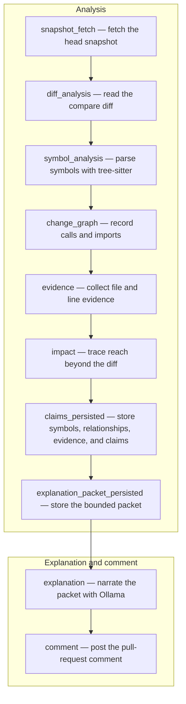

# PR Explain

PR Explain turns one pull-request head SHA into evidence-backed claims, then asks a local model to narrate those claims. Explain is the short change story, shown by default and posted as one pull-request comment. Details is the detailed page. If narration or the comment fails, the analysis stays.

The model does not analyze the repository. Deterministic analysis builds the change graph. Ollama only narrates a stored packet. The web app and the API never call Ollama.

## Run it

1. Install [Docker Desktop](https://www.docker.com/products/docker-desktop/).
2. Copy the environment file: `cp .env.example .env`
3. Start the stack: `docker compose up`

   The first start pulls `qwen3-coder:30b` (about 18GB) into the Ollama volume. On a Mac, Docker is a Linux VM and does not get Metal, so explanations run on CPU and can take minutes. That is expected. Changing `OLLAMA_BASE_URL` on the worker to another private Ollama is a config change, not a code change.

4. For GitHub webhooks, tunnel only to FastAPI:

   ```bash
   cloudflared tunnel --url http://localhost:8000
   ```

   Set the GitHub App webhook URL to `https://<tunnel-host>/api/webhooks/github`. Open the explanation page at [http://localhost:5173](http://localhost:5173).

5. Do not add port 11434 to the tunnel. Compose publishes Ollama on `127.0.0.1` only, on a network the API and the web app are not attached to.

GitHub App permissions: Metadata read, Contents read, Pull requests read and write. Events: `installation`, `installation_repositories`, and `pull_request` (`opened`, `reopened`, `synchronize`, `closed`). `closed` does not analyze. There is no Checks permission and no review score.

Point `GITHUB_APP_PRIVATE_KEY_FILE` at the downloaded PEM instead of pasting the key into `GITHUB_APP_PRIVATE_KEY`. Compose mounts that host file read-only and sets the env var to the container path:

```yaml
GITHUB_APP_PRIVATE_KEY_FILE: /run/secrets/github-app.pem
```

```yaml
- /path/to/app.private-key.pem:/run/secrets/github-app.pem:ro
```

## What you get

- Analysis status and explanation status are stored separately. A failed explanation leaves claims, files, and symbols on the page.
- Two views share one analysis. Explain is the change story and the diagram. Details is what changed, who calls it, file and line, tests, why a file outside the diff matters, and API or unknown facts.
- One conversation comment per pull request, updated in place for each new head SHA. A failed GitHub write does not discard the page.
- Revision deltas compare claim sets across head SHAs.

## Analysis and explanation

Analysis builds deterministic facts from the head snapshot, the diff, and tree-sitter. There is no model in that path. The facts are stored as symbols, relationships, evidence, and claims.

Explanation narrates a bounded packet of those claims with local Ollama. The model may not invent files, functions, or edges. If the model returns nothing usable, the document is filled from the packet claims.

`analysis_status`, `explanation_status`, and `comment_status` are stored separately. The GitHub comment is posted only after explanation succeeds. If explanation fails, the comment is skipped, and the stored analysis stays.

The stages run in this order:

`snapshot_fetch` → `diff_analysis` → `symbol_analysis` → `change_graph` → `evidence` → `impact` → `claims_persisted` → `explanation_packet_persisted` → `explanation` → `comment`



The LLM is used only in explanation, via Ollama, to narrate facts analysis already stored. The web UI reads those stored facts and the grounded document.

## Tests without Ollama or GitHub

```bash
cd backend
python3 -m venv .venv
source .venv/bin/activate
pip install -e ".[dev]"
pytest
```

Pytest covers the oauth fixture claims, the citation validator, job failure with a fake provider, and the comment renderer. Nothing in that suite downloads a model or contacts GitHub.

To look at the page locally without Compose, from `backend/`:

```bash
DATABASE_URL=sqlite:///./dev.db PYTHONPATH=. python -m app.seed
DATABASE_URL=sqlite:///./dev.db PYTHONPATH=. uvicorn app.api:app --port 8000
```

In another shell, `cd frontend && npm install && npm run dev`, then open the runs the seed command printed.

## Model bench

`python -m app.llm.bench` sends the frozen packets in `fixtures/bench` through the configured provider and writes a local JSON report. The report scores grounding, structure, latency, and process memory. It is a model eval. It is not a pull-request quality score and it is not shown to repository users.

## Privacy

The MVP path keeps the snapshot, the packet, and the narration on infrastructure you run. There is no OpenAI or Anthropic client and no silent fallback when Ollama is down. An unknown `LLM_PROVIDER` fails the explanation step and leaves the analysis intact. Anyone who later adds a hosted provider is choosing to send the packet off the machine. This repository does not do that.
